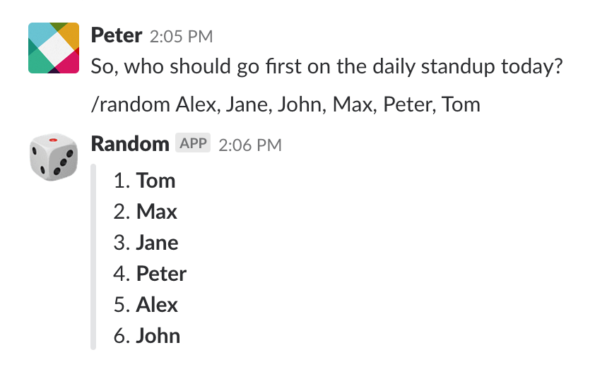

# Slack apps

 1. List randomizer
 2. TBD

## Running Locally

Make sure you have [Yarn](http://yarnpkg.com) installed.

```sh
$ yarn install
$ yarn dev
```

Your app should now be running on [localhost:3000](http://localhost:3000/).

## Deploying to Heroku

Make sure you have [Heroku CLI](https://cli.heroku.com/) installed.

```
$ heroku create
$ git push heroku master
$ heroku open
```

## Setup Slash Commands

1. Command name: `/random`
2. URL: `https://slack-apps.herokuapp.com/random`
3. Method: `POST`
4. Customize Name: `Random`
5. Icon: `:game_die:`
6. Description: `List randomizer`
7. Usage hint: `[comma separated list of options]`
8. Descriptive Label: `List randomizer slash command`


## Command example

 ```/random A, B, C, D```



## Slack API documentation
https://api.slack.com/slash-commands#responding_to_a_command